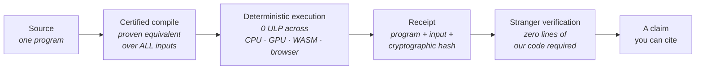

<picture>
  <source media="(prefers-color-scheme: dark)" srcset="https://raw.githubusercontent.com/coherence-energy-labs/.github/main/assets/banner-dark.svg">
  
</picture>

*The banner above is not a drawing. It is the solution of our field equation, computed in exact integer arithmetic
by [a program in this repository](https://github.com/coherence-energy-labs/.github/blob/main/tools/render_banner.py) and
re-derived by CI on every push — [if one byte drifts, the build goes red](https://github.com/coherence-energy-labs/.github/actions/workflows/verify-banner.yml).
Its receipt is [committed beside it](https://github.com/coherence-energy-labs/.github/blob/main/assets/RECEIPT.json) and printed on the artifact itself.*

 

**Provable software and applied systems, built on coherence energy —**
**one measurable way to know how well any system holds together, and to make it hold together better.**

 

[**Website**](https://coherenceenergylabs.com) &nbsp;·&nbsp; [**Live demos**](https://demos.coherenceenergylabs.com) &nbsp;·&nbsp; [**LumOne**](https://lumone.ai) &nbsp;·&nbsp; [**Contact**](mailto:info@coherenceenergylabs.com)

---

## The thesis

The things we study in separate rooms — physics, life, mind, and technology — are more deeply connected than our disciplines treat them. **Coherence is parts working together as one**, and our founding question is whether that connection can be made *measurable, testable, and engineerable*.

At Coherence Energy Labs it is not a metaphor. Coherence energy is a quantity — the cost of holding a system's order together against noise:

$$E_{\mathrm{coh}} \;=\; k_B T \, \cdot \, D_{\mathrm{KL}}\!\left(\rho_{\mathrm{system}} \,\|\, \rho_{\mathrm{disorder}}\right)$$

and coherence itself is a field we solve, with one governing equation reused across every domain we touch:

$$\left(D\,L + \kappa^2 I\right)\tau \;=\; s$$

The same screened field equation that schedules instructions inside our compiler forecasts natural hazards, plans spacecraft trajectories, drives the attention of our AI systems — and rendered the banner at the top of this page. **One discipline, from bare metal to cosmology.**

## The standard

> **A claim is only as strong as the artifact behind it.**

Modern software asks for trust. Ours is engineered so that trust is never required. Every result travels a chain of custody in which each link is checkable by a stranger:

- **Every result ships as program + input + receipt.** Anyone can re-execute it and get the same bytes.
- **Every guarantee has a gate that can say no.** Our CI gates are mutation-tested — we deliberately inject the bugs they claim to catch and prove they go red. A gate that cannot fail is not a gate.
- **Every failure is published, not buried.** We keep a falsification library of our own dead claims, dated and preserved. Negative results are load-bearing.
- **Everything fails closed.** When evidence is missing, the answer is "no" — in our compilers, our proofs, and our AI.

## By the numbers

| | |
|---:|:---|
| **0 ULP** | drift between CPU, GPU, WebAssembly, and browser execution of the same program — floating point included. Exactness is a contract, not an aspiration. |
| **2⁶⁴ⁿ** | inputs covered by each compiler-optimization equivalence proof. Machine-checked over *every* possible input, not tested on a sample. |
| **7** | compilation backends from one language — VM, C, native x86/ARM, LLVM, WebAssembly, GPU, and embedded scripting — proven to agree. |
| **29** | cryptographic primitives — classical and post-quantum — each verified byte-exact against independent NIST/RFC test vectors, interoperable with reference implementations. |
| **15** | communication-protocol specifications formally model-checked with an active attacker in the model. |
| **~9 ms** | to generate a million-point proof round on GPU, bit-identical to the reference prover. Verification runs client-side, in a browser. |
| **1** | field equation, solved everywhere: compiler scheduling, hazard forecasting, trajectory design, machine cognition — and this page's own banner. |

## What we build

| | |
|---|---|
| **Coherence Language** | A first-principles programming language, compiler, and runtime. Certified compilation — the toolchain *cannot miscompile*, because optimized and original are proven equivalent over all inputs before anything ships. The same source runs bit-identically from bare metal to your browser tab. |
| **LumOne** | A coherence-native AI whose every decision is re-runnable and receipted. Fifteen-plus sound solver lanes — exact arithmetic, theorem provers, computer algebra — answer *before* a model generates a single token. And when it cannot know, it does something no other AI does: it signs a **provable certificate of ignorance** instead of bluffing. **[Live now.](https://lumone.ai)** |
| **A.C.E** | A cognitive architecture built entirely in Coherence Language — a mind whose reasoning is auditable end to end. Its memory is Merkle-sealed, its forecasts are registered *before* the evidence arrives, and its self-modification sits behind supervised gates with measured keep-or-rollback. In active development. |
| **One Link** | Private communication with no servers. Post-quantum hybrid key exchange, forward-secret ratcheting, and a formally model-checked protocol core — privacy that holds against the next era of adversaries, not just this one. |
| **Obsign** | AI you can prove. Accountable computation for media and models: deterministic, bit-exact, with re-executable provenance assertions that today's content-credential standards define but do not deliver. |
| **Applied systems** | The same discipline pointed at the physical world: natural-hazard forecasting scored honestly against named baselines, hardware-rooted attestation proven on real silicon, verifiable measurement from sensor to signature, and trajectory design with proof-carrying routes. |

## Don't trust us — re-run it

Our [live demos](https://demos.coherenceenergylabs.com) hand *you* the verifier:

- **The Gauntlet** — honest and forged computation proofs, checked entirely in your browser. The forgeries fail on *your* hardware, by *your* arithmetic — not our word.
- **Re-executable figures** — every published chart is a program, its input, and its receipt. Your browser re-derives the result and confirms it, offline, from a local file, with no server to trust. A figure you can't fake is a figure you can cite.
- **CPU == GPU, live** — the same computation on two different substrates, agreeing to the last bit, in front of you.

No accounts. No telemetry. No network required. The proof either verifies on your machine or it doesn't.

**This page practices what it preaches.** The banner is a re-executable figure with [its receipt committed](https://github.com/coherence-energy-labs/.github/blob/main/assets/RECEIPT.json), guarded by [a public gate](https://github.com/coherence-energy-labs/.github/actions/workflows/verify-banner.yml) that re-derives it from source on every push and on a weekly schedule. Clone this repo and run `python tools/render_banner.py --check` — you'll re-create the org's face, byte for byte, on your own machine.

## How we work

**Artifacts before adjectives.** Nothing is called done, fast, or safe without a machine-checkable artifact behind the word.
**First failure is fuel.** A red gate is never reverted around — it is root-caused and the system comes back stronger.
**Falsify your own work first.** Every major claim ships with the experiments that tried to kill it.
**Preserve coherence.** We build systems that do not hide how they work — that can be inspected, that can prove what happened, and that hold together instead of falling apart.

---

 

**Early, but not empty.**

A working software stack. Applied systems in the field. An open technical foundation.
And a standard of evidence we intend to make ordinary.

 

[coherenceenergylabs.com](https://coherenceenergylabs.com) &nbsp;·&nbsp; [info@coherenceenergylabs.com](mailto:info@coherenceenergylabs.com)

 

